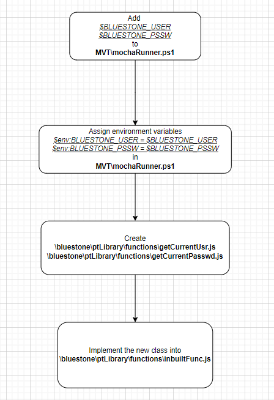

# Strategy to improve Bluestone team

## Goal: Facilitate the Bluestone adoption for developers and final users

## Objective 1: Video tutorials
Right now, we have some tutorials in text for users and developers however to make friendlier the transfer acknowledge a video is the best option
  Proposal:  
I can use CamStudio tool to record the tutorials
  Results:  
Create 3 video tutorial to week, right now we have 10 text tutorials, so the final result is having all video tutorials in 4 weeks
  
## Objective 2: Adding user and password to Mocha Test in MVT 
In some cases, the user and password that we use in the scripts can be expired causing repetitive efforts, to avoid this we can add the credentials in the MVT ang modify the code to replace them
  Proposal:  

   

Results:  
Finish the implementation in 2 weeks
  

## Objective 3: Create a Q&A web forum
We are going to need an easy way to support the Bluestone partners and the most of them have the same questions, if we give them a Q&A web forum, they can be available to resolve their own doubts reducing time and effort
  Proposal:  
I am investigation which tools is the best option, I need discuss with the team
Possible tools for the moment: Google groups, Qhub and OSQA
  Results:  
Pending
  
## Objective 4: Adding time out to scripts automatically
When we create the scripts, we need to set up the time out manually, if we implemented this automatically, we could reduce time and efforts 
  Proposal:  
I need to finish the Bluestone Developer Training to get a proposal
  Result:  
Pending

