# What is customized function and why do we need that 

In several cases we need to prepare the environment before of reproduce a test cases, for example, assume that in the test case we need to create an element so we use Bluestone to automate the creation of this element, if we don't prepare the environment each time that the script run is going to try to create the same element with the same name and properties this could be a problem because in the most cases the site don't allow have two elements with the same name, so before of create a new element we need to delete the old one   

 
 

To help the final user to prepare the environment we can create a customized function, so before of start to recording the user will be able to call the function to delete the element with the same name and this function will be recorded already in the script  

 
 

# How to add customized function 

To create a new customized function, we need to open a new terminal initialize bluestone with the command:  

***bluestone start .\\***  

In another terminal we run the command:    

bluestone function .  ***FunctionName***   

> Replacing ***FuntionName*** for the name of the function  

 
 

Bluestone should automatically add the line *FunctionName: new FunctionName.FunctionName()* to the *bluestone-func.js* file and create the *FunctionName.js* file, this file is going to be the template where we are going to create our function  

We can say taht the *FunctionName.js* file is divided into three parts the constructor, the async function and the API functions 

 
 

## Constructor 

In the constructor we can specify the locators that indicate to Bluestone when can display the customized function, for this we have to specify all the relevant locators in its respective area  

 
 

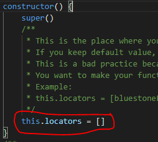   

 
 

## Async Function 

To get a better understanding we are going to call this function as **Main Async Function**, in this area we put the code that we want Bluestone execute when we call the function also we specify the parameters that Bluestone ask to the final user, for example, in the previous case where we need to clean the work space deleting some elements Bluestone use API requests and since all the sites have some level of security we need to request the user that indicate the **user name** and **password** for access to the site, also since the **URL** could change the time in time we will need the basic URL of the requests, probably also need to indicate the **element's name** that bluestone is going to delete   

When we create the template of the function the Async Function looks like this  

 
 

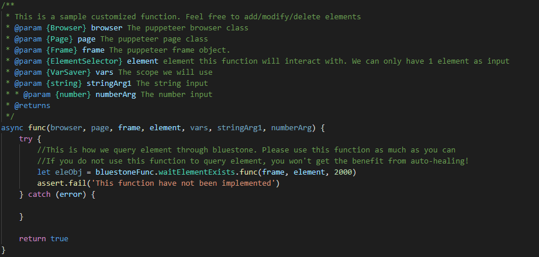   

 
 

If we must implement the previous example, we need to change the default variables for the variables that we need (URL, username, password, and element's name), please note that the change is in two parts (See the elements marked in yellow), after of the declaration of variables we put a little description that the user can read (See the elements marked in pink) 

  

Also, in the top of all configurations we put a name of the function that the user can recognize (See the elements marked in red)  

 
 

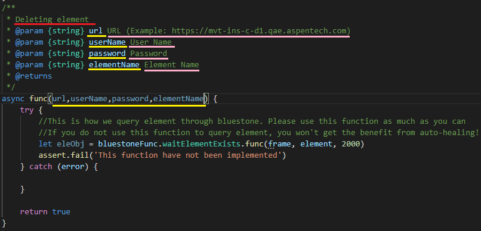   

 
 

With the previous configuration the user should see this in th UI:   

 
 

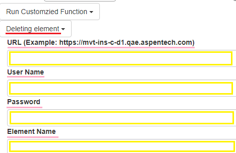   

 > How you can see all that you define in the code is going to be reflected in the UI 
 
 

## Sample Customized Function to Prepare Environment via RestApi 

The next step is creating the instructions that we want Bluestone to do when the function is called  

For "best practice" we are going to create **API Functions** outside of our **Customized Function** and those functions are going to be called in the **Main Async Function**, is very important that we call **API Functions** inside of the **try** of the **Main Async Function**, something like this:  

 
 

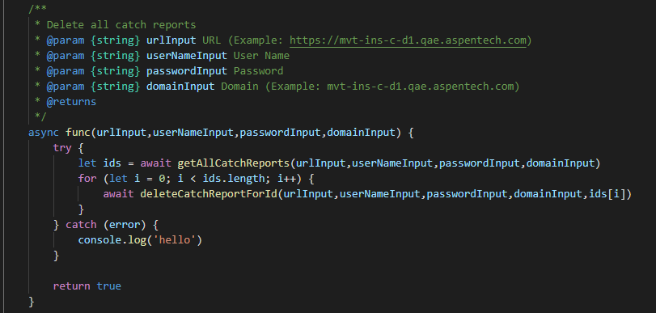   

 
 

How you can see, we called two **API Functions** "getAllCatchReports" and "deleteCatchReportForId", we called **API Functions** because they are created using the API requests. The first is called to get some ids and the other is used to delete the elements that correspond to those ids  

 
 

### Creating an API Function using requests 

Ok, now you know how the **Customized Function** is structured but.... What is inside of the **API Functions**?  

Before answering that we need to understand some basic concepts 

1. API Calls or Requests  

Is the process of a **client** application submitting a request to an **API** and that **API** retrieving the requested data from the external server or program and delivering it back to the **client**  

Each time that the **client** require get information of the **API** or need that the **API** modify something use an **API Call** and when the **API** receive and **API Call** the **API** is going to send a **Request** to the **client** 

2. Request Method  

A method indicates what is the basic purpose of the request. There are 4 types of methods: GET, POST, PUT and DELETE, in this moment we do not need to understand what the difference between them is, we only need know that each request has one  

3. URL's request  

Is the most essential element in the request, the URL's request indicates to the **API** which are the actions needed to execute the request     

4. Header  

In the header we can see a lot of information but the most important is the **URL's request** and the **method** 

5. Payload  

It is the crucial information that the **client** submits to the **API** when the **client** are making an API request, normally is sending with methods **POST** or **PUT** 

6. API key or access token  

The **API** needs to know if the request is being sent to an authorized user  

There are 2 ways to do it the first is sending the credentials (user, password and sometimes domain) and the second is with the **access token**, to get the **access token** we need to send a request with the credentials and then the **API** should respond us with an **access token**, this **access token** is going to be send it with the request  

7. Response  

When the **API** receives a request, it is going to send a response, the response is sent in JASON format and has information of success or failure and in some cases also has information that the **client** needs to show the information 

 
 

#### Obtain the request needed 

To get the requests that the **client** sends to the **API** please follow the next steps  

1. Open a web browser in incognito view 

2. In any part of the window press right click and select "Inspect" 

3. Go to "Network" and select the checkboxes "Preserve log" and "Disable cache" the window should look like this  

 
 

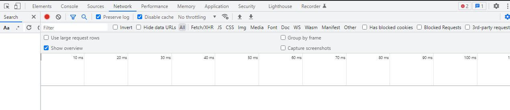   

 
 

4. Now all the requests that the **client** send its going to be recording after some actions in the web server the windows is going to looks like this  

 
 

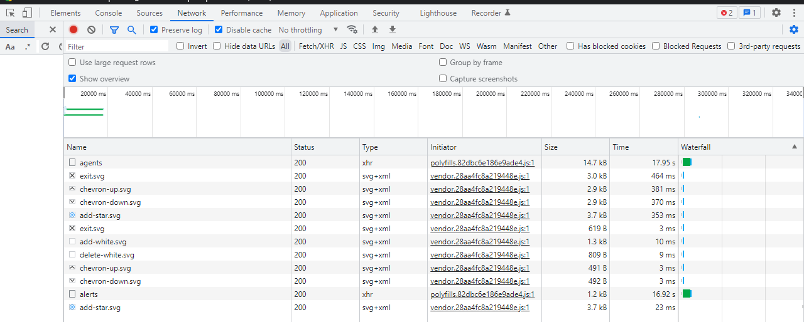   

 
 

5. Select any of the requests and the web browser is going to display the information of this request  

 
 

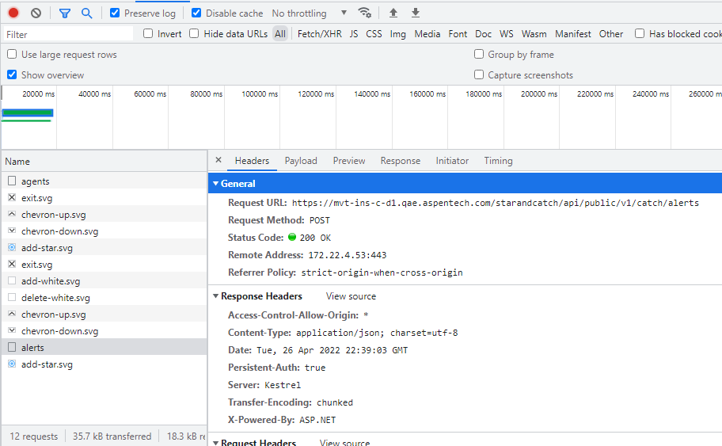   

 
 

6. There is not an easy way to identify the request that we need but you can see the following suggestions 

- Before of make the action in the web browser you can clear the recording, if you do that when you make the action the only request that is going to display are those which are relates with the actions, for example supposed that when you press a button the web browser display a list of elements so before of press the button you can clear the recording and then press the button, so when you look for the request which response has the information that you need is going to be easier 

- When you look for a request that asks for information start with the request which method is a GET or POST 

- It is difficult to read a response because it is in JASON format so you can use a JSON Viewer like this *[tool](http://jsonviewer.stack.hu/)*, we can copy/paste the response in the text area and the tool will show us the information in an uncomplicated way to understand, plese see the images below  

 
 

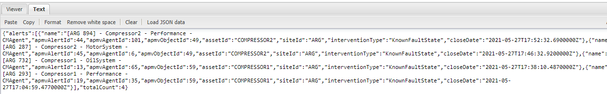   

 
 

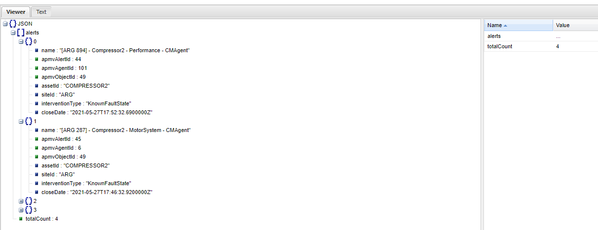   

 
 

- If we need a request to delete elements, the request has the method DELETE 

 
 

#### Identify the access 

As we saw earlier there are two ways to demonstrate to **sever** that we are authorized people  

The first way with **Access Token**, when the request has an Authorization section like the image below means that the request uses an **Access Token** otherwise the request needs to send the **user's name** and **password**  

 
 

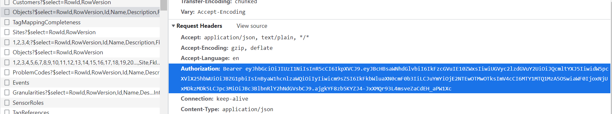   

 
 

#### Create our API Function 

 
 
 

##### Create our API Function using the Token 

1. We need to create a function that use the request to access to the site, for example when we want to access a site and the site ask us a user and password the request to access is going to be sending when we press the button of login, we can identify this request because its response should include the **Access Token** like this:  

 
 

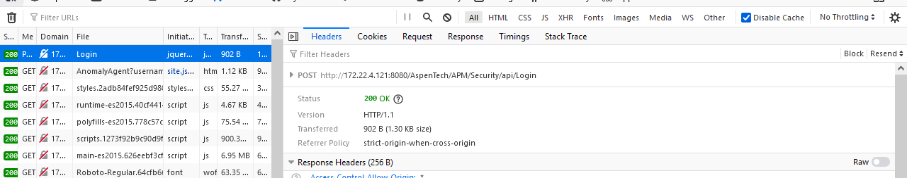   

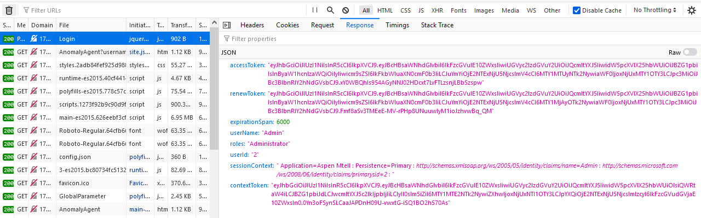   

> In this case we do not need use the JASON Viewer tool because in FireFox the response is already converted in a straightforward way to see 

 
 
 

2. Once we identify the request of Login, we can extract the URL and create the authenticate function. Please note that the user, password, and part of the URL are sending like parameters because the final user is going to indicated   

 
 

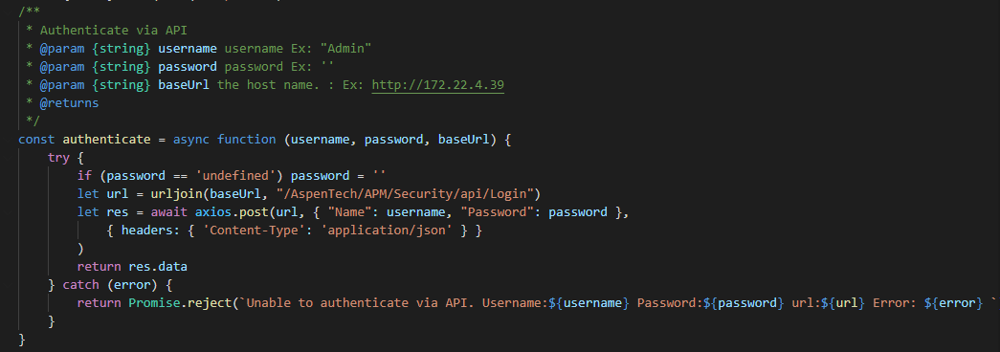   

 
 
 

4. Now we are going to create our API Function taking the URL's request, please remember that part of the URL is indicated for the final user, so we are going to get like a parameter 

5. After creating the URL's request we are going to get the **Access Token** with our Authenticate Function 

6. With the URL's request and the **Access Token** we are going to create the variable **res** and store the response of the request that uses the URL and the **Access Token** 

7. Finally we are going to manipulate the information of the response to get the element/s that we need  

 
 

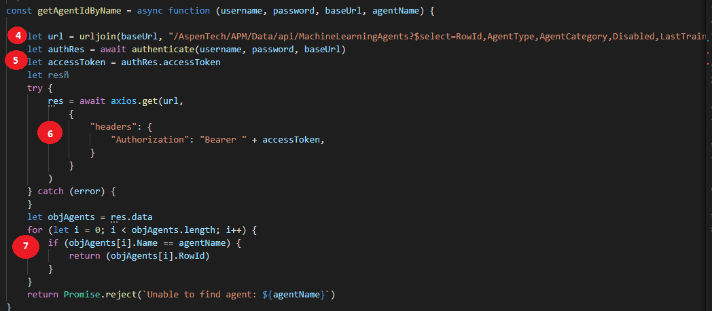   

 
 
 

##### Create our API Function using API Access 

 
 

1. Now we are going to create our API Function taking the URL's request, please remember that part of the URL is indicated for the final user, so we are going to get like a parameter 

2. Specify the method 

3. Specify the data, in the data we are going to indicate the information of the Payload 

4. We include in the beginning of function the variable credentials with the user and password, this is because the request of the example does not use an **Access Token**   

5. Finally we are going to manipulate the information of the response to get the element/s that we need  

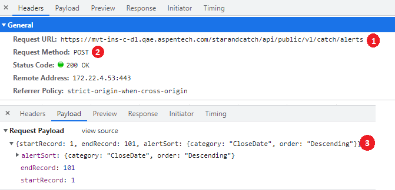   

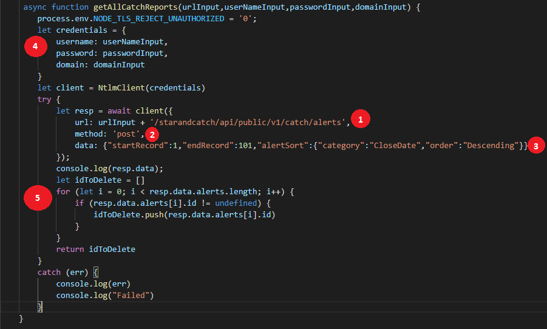   

 
 
 

# How to update customized function 

Sometimes there is a product change and with this the request taht we use could also change  

In that case first we need to identify where the problem is  

To identify it we can put Debugger Points in the **API Functions** specifically in the catch areas and then run manually a test case which is calling the **Customized Function**, with this we can know in which API Function is the problem  

Once we identify which is the API Function that we need to fix we are going to record again the request that the site uses to make the action and we will compare, if there is something different, we only need no replace it 