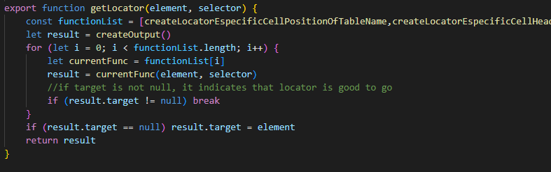
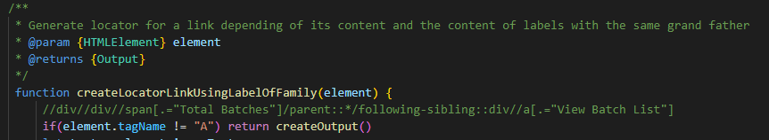
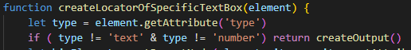
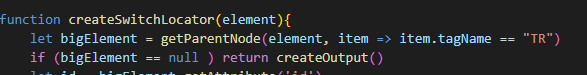
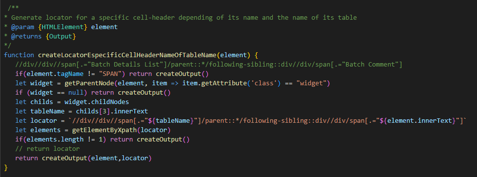

# Locator Function Introduction 

If you have worked with Bluestone, you will be familiar with the button "Revert Selector", this button helps us to automatically generate the locator for a Web Element that we selected previously  

The functionality of "Revert Selector" button is provided by *"bluestone-selector-gen.js"* class and this class is made up for *"Locator Functions"*  

Each Locator Function is created for a specific web-element, the objective is identifying some HTML elements in a specific structure that appear only in this web-element and then with these same HTML elements Bluestone is going to create the locator 

 
 
 

# Structure of bluestone-selector-gen.js 

The main function is *"getLocator"* this function call to the rest of the locators functions, in the first line of *"getLocator"* you can see the const *"functionList"* in this list are the locators function, once the *"getLocator"* function is called Bluestone is going to execute the first locator function in the list, if this first locator function doesn't generate a locator that we can use Bluestone is going to call the next function, if any locator function works the *"getLocator"* is going to return an object with null elements 

   

    

 
 

# Creating a Locator Function 

First, we need to create manually a Locator, please see Create-locator-generator manual, this locator manually created is going to give us a reference of what we want to generate  

All the locator functions have one and only one parameter and this parameter represent the web-element which we are working (the web-element that we selected when we press ctrl+q in the Bluestone UI), in this example we are calling the parameter like *element*  

Now you must ask if the web-element has the specific properties that identify it as the element for which the function was created  

 
 

For example, you can ask if the element has a specific tag   

    

 
 
 

Also, you can ask if the element has a specific attribute and if this attribute is equal to a value or a set of values   

    

 
 

Please see the previous two examples and analyze what happened when the element does not have the tag or the attribute that we are searching for   

How you can see when the tag or the attribute do not match, we return the function *createOutput* without arguments, when the functions return that the code go to the next locator function  

 
 

## Use parentElement method 

Sometimes we also need to know the properties of parent's element for that we have the method *parentElement*   

Its syntaxis is    

*parent = element.parentElement*   

The result of this is that the variable *parent* is going to be the web-element which child is the *element* 

 
 

## Use getParentNode function 

In some cases, we need find a specific parent of an element, for that we have the *getParentNode*  

The following example can read like "Give me the first element's parent which has tag like **TR**, if there is not any parent with that specification (if the result of *getParentNode is **null**) return the function *createOutput* without arguments"   

   

 
 

## Use childNodes method 

The childNodes method is the opposite of parentElement method, its function is getting all the element's sons  

Its sintaxis is    

*let childs = element.childNodes*  

The result of this is that the variable *childs* is going to be an array, and each element of the array will be a web-element which parent is the *element*  

 
 

## Use getElementByXpath function 

Ok, now we know how to get all the elements that we need to create our locator but how do you know that the locator works and not only that, if works, how can we know if the locator only works for our specific web-element and no other. For this we have the *getElementByXpath* function   

Its sintaxis is    

*let elements = getElementByXpath(locator)*  

The result of this is that the variable *elements* is going to be an array, and each element of the array will be a web-element that match with our *locator* , once we have the result of the getElementByXpath function only need to ask how many elements have the array, if number of elements are 0 then the locator does not work, if number of elements are more than 1 then the locator works for several web-elements, therefore the locator only works if the length of the array is equal to 1  

A final locator function looks like that  

 

Please note that in the final line we return the *createOutput* with element and locator like parameters 