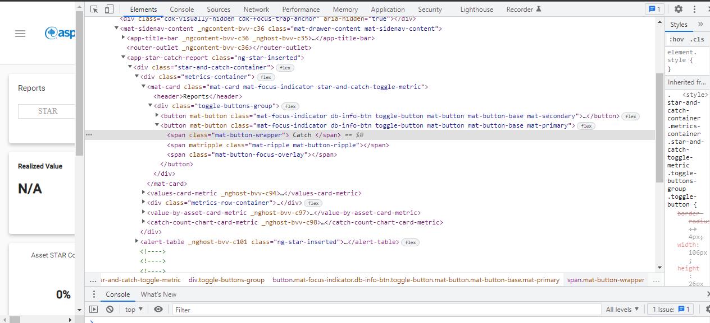
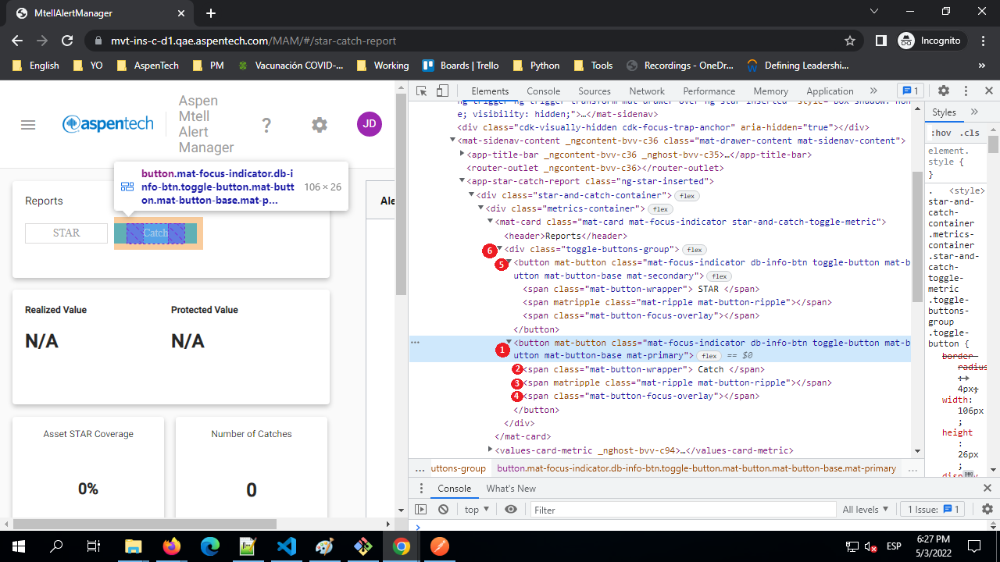
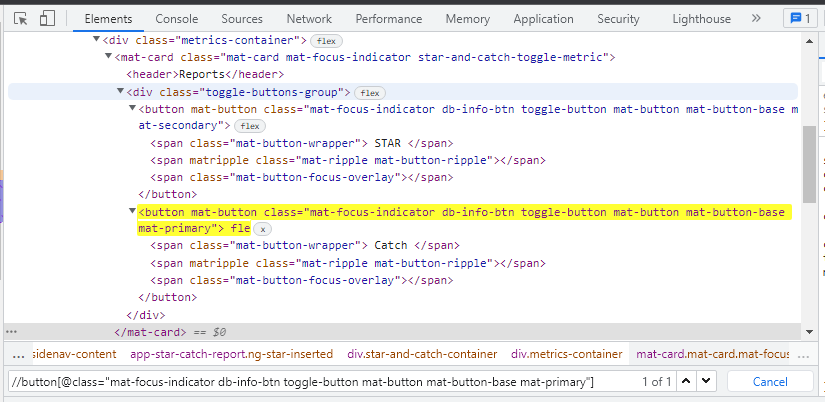
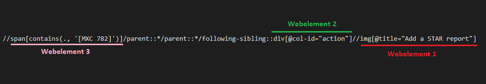

# What is locator 

To provide a satisfactory understanding of the locators first we must be clear the concep of **webelement**  

A webelement is any element in the site with which we interact. For example, when we are on a login page, we put username and password after that we press the access button, in this example the textbox which we introduce the username and password are webelements, as well as the button  

Other examples of webelement are check-boxes, radio-buttons, lists, tables and even labels. 

The **locator** is a string that identifies uniquely a webelement using the help of any of the attributes within the html tag or using a combination of attributes on the html tag 

 

# Why do we want to generate a locator 

When we use Bluestone to automate a test case it needs to identify all webelements that we worked when we manually reproduce the test case.  

The locator is the mean element in Bluestone, the correct creation of the locators is essential to the correct work of Bluestone 

 
  

# Creating Locators 

To create a locator of a webelement first need to know its HTML structure, to do, we can press right click in the web element and select "*Inspect*", the browser displays a work area with several tabs, we go to "*Elements*" tab and then we can see the HTML structure of all the site and the mark row correspond to the webelement  

 
 

   

    

 
  

## Attributes 

Once we have the HTML's structure, we need to select the attributes that we can use to identify uniquely the webelement  

- ID 

Usually, the webelement has a unique ID, the problem is that some sites change the IDs in each new session, so before of use the ID we need to be sure that is not going to change when we finish the session and start a new one 

 
 

- Class 

A class is another attribute that most webelements have, the issue with the class is that it is common that several webelements have the same class, so we can say that it is helpful to create a locator but is not enough  

 
 

- Type 

The type is like a class (is helpful to create a locator but is not enough), if we compare the type with the class, we can say that is more friendly to use but is less common  

If the webelement has a type, it is recommended to use it in the creation of the locator  

 
 

- Content 

Some webelements have a text that can be reading for the user, the labels and cells are good examples of that, we can identify a webelement for its content (text), the issue with this metho is that the text could be changed for the developer when they change the version, so is not very recommended to use it unless the webelement be a message 

 
 

- Webelement's family 

Sometimes a webelement does not have enough attributes to generate a good locator in that case we can use the attributes of the others webelements which are related to our main webelement  

For example, in the image below our main webelement is the *button "Catch"* (1), this webelement is the parent of another webelement that contain the *text "Catch"* (2) and the parent of another two webelements (3 and 4). Also is the sibling of the *button "STAR"* (5), and is the child of the webelement with the *class "toggle-buttons-group"* (6)  

 
 

    

 
  

## Structure 

First, we need to indicate to the browser that the string we are looking for is a locator, for it, we start with "*//**" 

  

Then we specify the attributes that we are going to use, these attributes must be grouped for the **tag** where are ubicated  

In the example that we are using we want the webelement with the class *mat-focus-indicator db-info-btn toggle-button mat-button mat-button-base mat-primary* and with the tag *button* so the locator should be:  

 **//button[@class="mat-focus-indicator db-info-btn toggle-button mat-button mat-button-base mat-primary"]**  

This locator works well as there is only one webelement with this tag and this class  

 
 

    

 
 

The issue with this locator is that if in the next versions the developer create another webelement with the same class and the same tag the locator is not going to work, so we can be more specific indicating also the locator of its child: 

 **//span[.=' Catch ']/parent::button[@class="mat-focus-indicator db-info-btn toggle-button mat-button mat-button-base mat-primary"]**  

The locator above could translate to this: "Give me the webelement with the tag "*button*" and the class "*mat-focus......*" and with a child which have the tag "*span*" and the text *' Catch '*  

Now we are going to supposed that after some changes in the site we discover that the class of our webelement is changing so we cannot use any more, in this case the locator should be:  

 **//span[.=' Catch ']/parent::button**  

How you can see, sometimes it is better do not to be so specific, unfortunately there are not rules and the procedure to create a good locator could change depending on the site 

 
 

The following examples illustrate ways of creating locators 

1. //DIV[text()='Version: 12.2.1']  

Give me the webelement with the tag "*DIV*" and the contain like 'Version: 12.2.1'   

 
 

2. //div[@tabindex="0"]/div[.="test1.csv"]  

Give me the webelement with the tag "*div*", wich contain is "*test1.csv*"; The webelement must be a child of webelement with the tag "*div*" and the attributte "*tabindex*" iqual to 0   
 
 

3. //span[contains(., '[MXC 782]')]/parent::*/parent::*/following-sibling::div[@col-id="action"]//img[@title="Add a STAR report"]  

Give me the webelement with the tag "*img*" and with the attribute title "Add a STAR report"; This webelement must be a child or a grandchild of the webelement2, the webelement2 must have the tag "*div*" and the col-id "*action*", also the webelement2 must be the sibling of the father of the father of the webelement3, the webelement3 should have the tag "*span*" and a text that contains the string '[MXC 782]'  

 
 

    

   
 

4. //TR[@id='Simulation_to_FlatFileVertical']//input[@role="switch" and @type="checkbox"]  

Give me the webelement with the tag "*input*", the role "switch" and the type "*checkbox*"; Also, the webelement must be the child or the grand child of a webelement with the tag "*TR*" and the id "*imulation_to_FlatFileVertical*"   

 
 

5. (//div[@role="option"]//i[.="check_box_outline_blank"])[1]  

Give me the webelement with the tag "*i*", and the text like as "check_box_outline_blank"; Also the webelement must be the child or the grand child of a webelement with the tag "*div*" and the role "*option*"; In the end there is a number 1 between brackets that means that if there are more than one webelement that corresponds with the locator we are use the first of them    

 