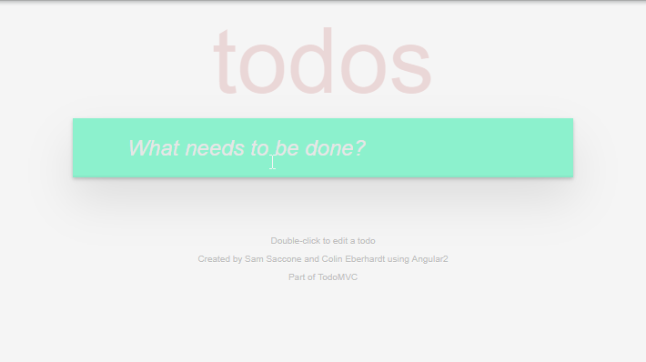
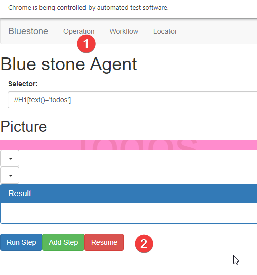

# What is Typical Process of recording workflow
## Overall Step
Create UI automation is easy, here is general breakdown
* Launch Bluestone
* Record Steps and Add Validation
* Correlate Locator when recording is done
* Test Run your script
* Output Script

## Launch bluestone. 
1. Launch Bluestone Service
   1.  In a command prompt, run command: ``bluestone start "path to your automation project"``
   2.  
2. Start recording
   1. Start a seperate command prompt
   2. Run command ``bluestone record "https://todomvc.com/examples/angular2/"``
   3. 

3. Status Check 
   1. if there is red/green rectangle when you hover your mouse over different elements. You may refresh web browser. Bluestone shall load automatically.
   2. 
   3. 
## Record Your Step and add validation
* Summary
   * In this section, we will cover how to record your first workflow. We will do something pretty straight forward, 
     * Click "What needs to be done" input
     * Type "sleep"
     * Hover mouse over "sleep" in the todo list
     * Delete this todo list
* Record
  * Hover your mouse over "What need to be done" input, it will be higlighted in green, this indicates that the element has been defined, you are good to proceed
    * 
  * Just click on this element and enter sleep with your keyboard press enter to add this item to the todo list
  * Next, Before we click "sleep" in the todo list, we will need to hover our mouse over to it. It will be highlighted in red, this indicates that this element is either undefined or defined for multiple times. We will need to resolve this.
    * 
  * Call bluestone agent by pressing "Alt+q"
  * You expect to see a new page pop up. On the rigth, you expect to see a page that exactly match where we used to be.You will notice that there is nothing under "Possible Locator" section. This indicates that this is a locator, we have never defiend in the past.
    * 
  * To define the locator, enter locator name and click on revert to use default locator. And then click on confirm. You expect to see a green "Success" message if everything looks good.
    * 
  * After you finish recording, you can click "Operation" menu to go back to operation menu
  * Click "Resume" button to go back to recording mode
    * 
  * 
    
## Traffic Light Object Recognition
* In order to help user understand which element has been defined and which have not, bluestone use different color to indicate if an element has been defined or not.
* If element has been defined, it will be highlighted in green, which means the element has been defined. You can proceed and interact with this element
  * Sample
    * 
* If element is highlighted in red, it indicates that the element has not being defined or has been defined in multiple places, we will need to define this element before we proceed
  * Sample
    * 
  * Select element in case this element has been defined
    * 
  * Define Locator in case element has not been defined
    1. Hover your mouse over element that is highlighted in red
    1. Press Alt+q combo key to call bluestone tab and it will pause recording
    1. You expect to face following two scenario
      * Element has not being defined
         
         1. In section 1, you expect to see a full repica of the page where you took snapshot. In case you didn't see that, Go to operation tab and click resume button. And repeat step 1-2 again till you see the right view
         2. Enter the locator name in (2)
         3. Click "Revert Selector"(4) to use default locator that is generated by bluestone. And it will populate section (3) automatically.
         4. If you don't like default locator, you can modify input(3)
         5. Click "Confirm"(5) button to ensure your locator is working. You expect to see selected element has been highlighted in blue rectangle and the status bar has changed to "Success" with green background
            1. 
         6. After you finish recording, you can click "Operation" menu to go back to operation menu
         7. Click "Resume" button to go back to recording mode
            1. 
      * Element has been defined multiple times
        * 
* When you hover your mouse over a element, it 
1. Add a validation (Pause Record)
   1. Press Alt+q combo key to call bluestone tab
   2. In spot (1), select your intention. In this case, select "verify"
   3. In spot (2), select specific step you would like to take. In this case, select "element exists"
   4. In spot (3), type in waiting time, please make sure it is greater than 1s
   5. In spot (4), run step to verify you work
   6. If everything looks good, click spot(5) to add this to the workflow steps
   7. If you want to resume your recording, click spot (6)
   8. 
2. Correlate Locator when recording is done
   1. Press Alt+q combo key to call bluestone tab
   2. Go to workflow panel. In the panel, choose workflow (spot 1)
   3. Specify test suite name and test case name. 
      1. Please note that, testcase name will be used as file name as well. PLease make sure it does not contain illegal characters (spot 2 and 3)
      2. 
   4. Correlate Locator by clicking "Resolve Pending Issue" button (spot 4)
   5. You expect to see message in the note bar(spot 5) about your action item. Most likely, you will be asked to correlate locator
   
   1. Go to particular step and click "Edit Locator" Button 
   2. In the Locator Definer view, enter locator name (spot 1) and locator (spot 2). bluestone support both selector and xpath. Otherwise, you can click "Revert" button to use default locator. You can click on "Confirm" button once you are done
      1. On the right side, you expect to see the view where this particular step is taken. Html is incorrect, you can use Previous html or Next html button to navigate through 
      2. If you want to override existing locator with what you provide, you can use "force override" button
      3.  
   3. Repeat 4,5,6,7 until you correlate all locators. You expect to see text like
      1. Please note that Bluestone will automatically correlate existing locator in its library
      2. 
3.  At this point, you can click on "Run Workflow Button" to test run your script.
4.  Output script. Click "Create Testcase Button" to output your script
   4.  
