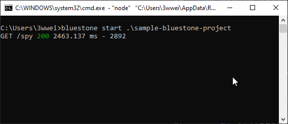
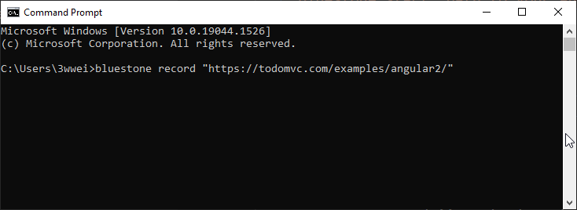

# What is Typical Process of recording workflow
## Overall Step
Create UI automation is easy, here is general breakdown
* Launch Bluestone
* Record Steps and Add Validation
* Correlate Locator when recording is done
* Test Run your script
* Output Script

## Launch bluestone. 
1. Launch Bluestone Service
   1.  In a command prompt, run command: ``bluestone start "path to your automation project"``
   2.  
2. Start recording
   1. In a seperate command prompt, run command ``bluestone record "your url"``
   2. 

3. Status Check 
   1. if there is purple rectangle when you hover your mouse over different elements. You may refresh web browser. Bluestone shall load automatically.
   2. 
## Record Your Step and add validation
1. Run your workflow. 
   1. For complicated web page, I would recommend to do so at rate of 1 operation/second
2. Add a validation (Pause Record)
   1. Press Alt+q combo key to call bluestone tab
   2. In spot (1), select your intention. In this case, select "verify"
   3. In spot (2), select specific step you would like to take. In this case, select "element exists"
   4. In spot (3), type in waiting time, please make sure it is greater than 1s
   5. In spot (4), run step to verify you work
   6. If everything looks good, click spot(5) to add this to the workflow steps
   7. If you want to resume your recording, click spot (6)
   8. 
3. Correlate Locator when recording is done
   1. Press Alt+q combo key to call bluestone tab
   1. Go to workflow panel. In the panel, choose workflow (spot 1)
   1. Specify test suite name and test case name. 
      1. Please note that, testcase name will be used as file name as well. PLease make sure it does not contain illegal characters (spot 2 and 3)
      2. 
   1. Correlate Locator by clicking "Resolve Pending Issue" button (spot 4)
   1. You expect to see message in the note bar(spot 5) about your action item. Most likely, you will be asked to correlate locator
   
   1. Go to particular step and click "Edit Locator" Button 
   1. In the Locator Definer view, enter locator name (spot 1) and locator (spot 2). bluestone support both selector and xpath. Otherwise, you can click "Revert" button to use default locator. You can click on "Confirm" button once you are done
      1. On the right side, you expect to see the view where this particular step is taken. Html is incorrect, you can use Previous html or Next html button to navigate through 
      2. If you want to override existing locator with what you provide, you can use "force override" button
      3.  
   1. Repeat 4,5,6,7 until you correlate all locators. You expect to see text like
      1. Please note that Bluestone will automatically correlate existing locator in its library
      2. 
4.  At this point, you can click on "Run Workflow Button" to test run your script.
5.  Output script. Click "Create Testcase Button" to output your script
   2.  
