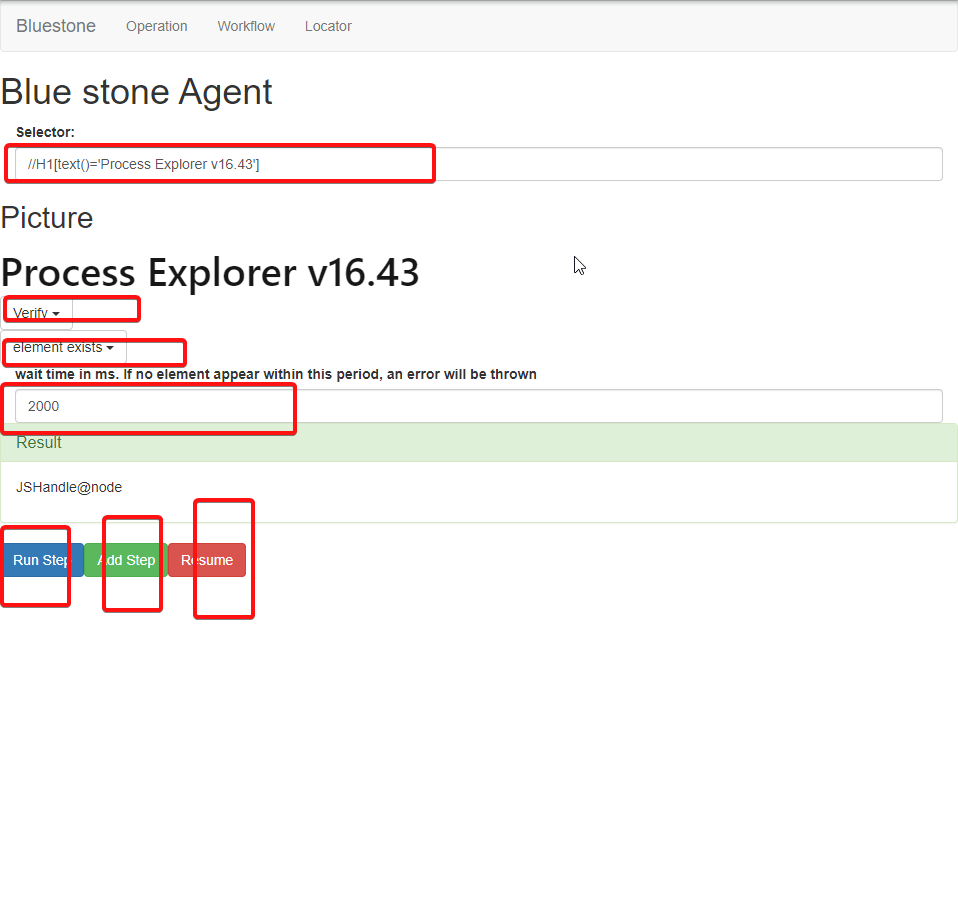

# Intent
Create Integration test and test all APIs for the bluestone console.

# Test Strategy
* Understand the API we send to back end
* Understand the change in the backend
* Create a script to send API request to backend and verify the desired change happen

# Understand the universe
Take operation page as an example
  

# How to get API
* Launch Dev Tool
* Go to network tab
* check Perserve Log
* Perform operation and identify the API traffic
* If want, you can decode the API to understnad the context via decodeURIComponent()
* 

