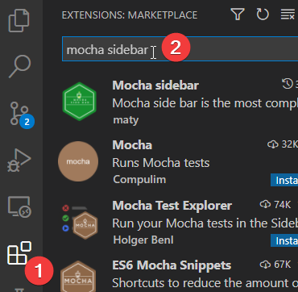
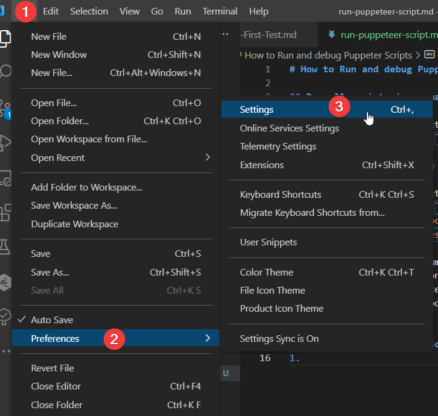
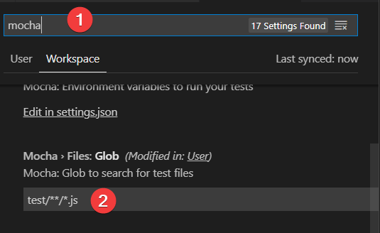
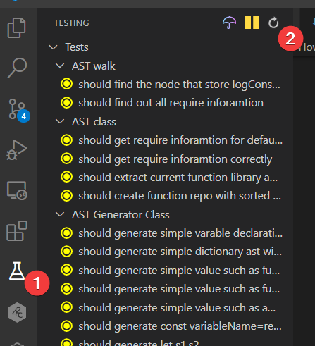
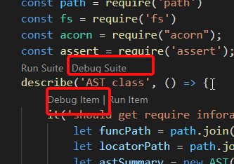
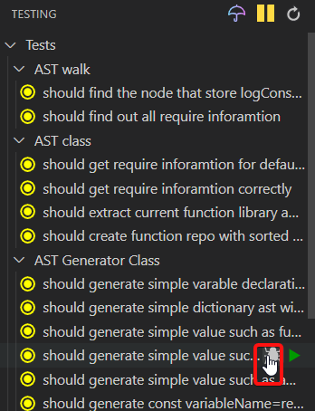
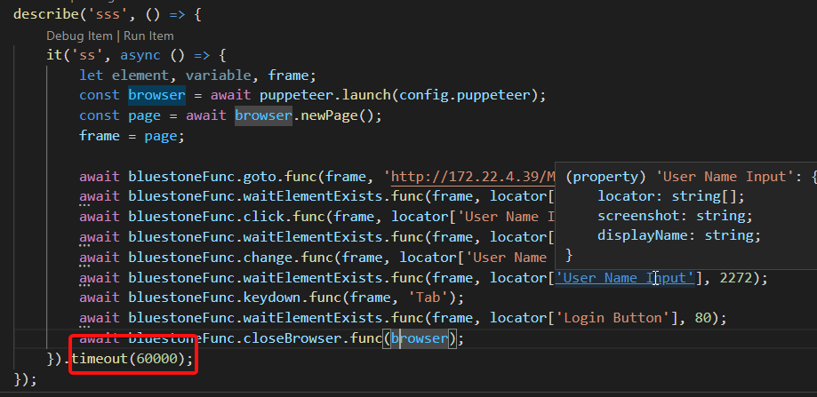

# How to Run and debug Puppeter Scripts

## Run all script via command line
1. Launch command prompt
2. go to automation project root folder
3. Run following command: ``npm start``

## Run particular testcase via commnd line
1. Launch command prompt
2. go to automation project root folder
3. Run following command: ``node ./node_modules/mocha/bin/_mocha ./script/*.js --exit true --grep "^test1 test2$"  --timeout 60000s``
   1. --timeout the maximum timeout for each test case execution
   2. ^test1 test2$, the test suite and test case name. It supports regular expression

## Configure Runtime in vscode
1. Install Vscode Extension: "Mocha sidebar" 
2. Go to setting menu 
3. In setting, search keyword "mocha"
4. Go to Mocha>Files: Glob.
5. Change pattern to "test/**/*.js"
   
6.  Go to testing tab in vscode and click refresh key, it should find your script autoamtically
   
7. Go to any test file, you can debug the testcase
   1. 
   2. 
8. Depends on the length of your test, you may need to update timeout
   1. 